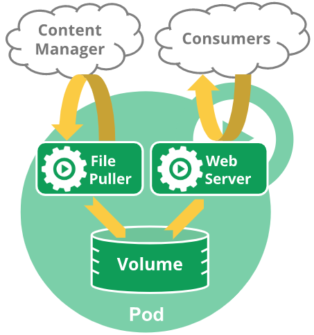

# Pods

Pods are the core abstraction of Kubernetes. Pods are named for "peas in a pod", because each Pod can contain multiple running images, called _Containers_. A single Pod might contain several Containers, each forming one component of a larger app.

For example, a Pod containing a webapp might have several containers:

- One Container for the backend MySQL database
- A second Container for an NGINX frontend web server
- Several other Containers for microservices to link the frontend and backend.

Of course, you can also deploy a Pod with just one Container, when that is appropriate for your architecture.

## Pod Scaling

The official Kubernetes docs say:

> Each Pod is meant to run a single instance of a given application. If you want to scale your application horizontally (to provide more overall resources by running more instances), you should use multiple Pods, one for each instance.

Thus, when developing a new app you should design your Pod so it can be horizontally scaled.

## Collections of Pods

### ReplicaSets

Pods themselves *don't* deal with issues such as autoscaling, self-healing, or upgrade rollouts. Those are handled by abstractions built on top of Pods: ReplicaSets and Deployments. A ReplicaSet manages several identical Pods and handles autoscaling and self-healing. When the ReplicaSet detects that one of its Pod is unhealthy or unreachable, the ReplicaSet starts a brand new Pod to replace the old one.

### Deployments

Deployments, in turn, manage ReplicaSets. When you submit an updated Pod spec to the Deployment in kubernetes, the Deployment starts a new ReplicaSet with the new Pod spec. After the new ReplicaSet becomes healthy, the Deployment begins serving from the new ReplicaSet, and deletes the previous one.

Using these abstractions allows Pods to ignore most of their own lifecycle. Once a Pod is started on a particular Node, the Pod and all its Containers will remain there for their entire lifecycle. Upgrading Pods and fixing broken Pods both involve starting a brand new Pod from scratch.

> Although Pods are the core abstraction of Kubernetes, when working with Kubernetes you will usually create and manage Deployments rather than individual Pods.

## Communication between Containers

All the Containers in a single Pod can access each other via ports on `localhost` with no configuration.

Communication between different Pods requires configuring a kubernetes Service, which behaves somewhat like both a DNS entry and a firewall rule.

## Volumes

By default the Containers in a Pod have separate filesystems, to prevent them from interfering with each other. By using a Volume you can designate a shared storage mount for a Container. Each Container in the same Pod that is also configured with Volume storage can then see and interact with the same files.

An example from the official docs: you might have a Container that acts as a web server for files in a shared Volume, and a separate "sidecar" Container that updates those files from a remote source, as in the following diagram:

The separate Containers can be given different security permissions and hardening: the web server should only have read access to the shared Volume, while the updater can write to the shared Volume but can't affect anything else in the web server's Container.

### Volume Lifecycle

Volumes only last as long as the Pod that created them. If one or more Containers is restarted inside a Pod, the replacement Container will have access to the same Volume, including all the changes that have happened.

If a Pod dies, however, any Volumes it contained are lost. New Pods that kubernetes starts to replace the dead Pod will have fresh Volumes with no data.

---

# Lab: inter-Pod communication

---

## PersistentVolumes

To enable long-term data storage, that lasts longer than a Pod's lifecycle, kubernetes provides PersistentVolumes and PersistentVolumeClaims. Containers access these like any other Volume, but kubernetes keeps track of changes and manages persisting them over time.

The PersistentVolumes are set up by the cluster administrators, sort of like Nodes. In the same way that a Node is an abstraction that can respresent any variety of hardware or cloud servers, a PersistentVolume is an abstraction over any type of persistent storage. The official docs give the examples of a Google Compute Engine persistent disk, an NFS share, or an Amazon Elastic Block Store volume.

> It's possible to configure multiple types of PersistentVolumes in a cluster, and then configure each individual Pod to use a particular type of PV based on performance, cost, or features of the underlying storage system.

The app developer creates Pods to use the cluster's Nodes, and creates PersistentVolumeClaims to use the cluster's PersistentVolumes.

---

# Bonus Lab: PersistentVolume

Adapted from https://kubernetes.io/docs/tasks/configure-pod-container/configure-persistent-volume-storage/
