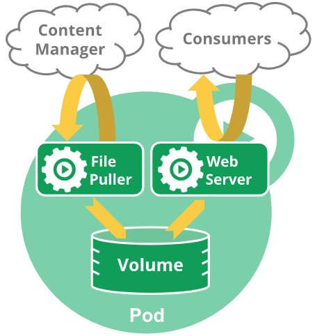

By default the Containers in a Pod have separate filesystems, to prevent them from interfering with each other. By using a Volume you can designate a shared storage mount for a Container. Each Container in the same Pod that is also configured with Volume storage can then see and interact with the same files.

An example from the official docs: you might have a Container that acts as a web server for files in a shared Volume, and a separate "sidecar" Container that updates those files from a remote source, as in the following diagram:

The separate Containers can be given different security permissions and hardening: the web server should only have read access to the shared Volume, while the updater can write to the shared Volume but can't affect anything else in the web server's Container.

## Volume Lifecycle

Volumes only last as long as the Pod that created them. If one or more Containers is restarted inside a Pod, the replacement Container will have access to the same Volume, including all the changes that have happened.

If a Pod dies, however, any Volumes it contained are lost. New Pods that kubernetes starts to replace the dead Pod will have fresh Volumes with no data.
